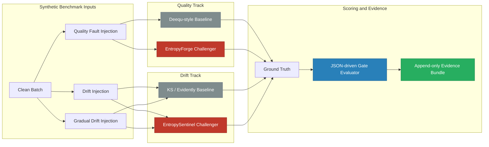

# Entropy Quality & Drift Benchmark

<p align="center">
  <a href="https://github.com/Org-EthereaLogic/entropy_quality_drift_benchmark/actions/workflows/ci.yml"></a>
  <a href="https://codecov.io/gh/Org-EthereaLogic/entropy_quality_drift_benchmark"></a>
  <a href="https://app.codacy.com/gh/Org-EthereaLogic/entropy_quality_drift_benchmark/dashboard"></a>
  <a href="https://snyk.io/"></a>
  <a href="https://www.python.org/"></a>
  <a href="https://opensource.org/licenses/MIT"></a>
</p>

**A public, replayable benchmark for proving where Shannon Entropy helps and where it still needs calibration in Databricks-style data quality and drift evaluation.**

**Built by [Anthony Johnson](https://www.linkedin.com/in/anthonyjohnsonii/) | EthereaLogic LLC**

---

<details>
<summary><strong>Table of Contents</strong></summary>

- [What Makes This Different](#what-makes-this-different)
- [Benchmark Architecture](#benchmark-architecture)
- [Current Benchmark Status](#current-benchmark-status)
- [Dual-Track Evaluation](#dual-track-evaluation)
- [Gate Evaluation Matrix](#gate-evaluation-matrix)
- [Technology Stack](#technology-stack)
- [Automation](#automation)
- [Quick Start](#quick-start)
- [Project Structure](#project-structure)
- [Agent and Claude Commands](#agent-and-claude-commands)
- [Contributing and Security](#contributing-and-security)

</details>

---

## What Makes This Different

Most public data-quality repos either show rule-based checks in isolation or
assert that entropy-style signals help without proving it head to head. This
repository does the comparison directly:

- **Quality track**: `EntropyForge` vs. Deequ-style rules
- **Drift track**: `EntropySentinel` vs. KS-test / Evidently-style checks
- **Frozen gates**: benchmark verdicts are driven from [`configs/kpi_thresholds.json`](configs/kpi_thresholds.json)
- **Append-only evidence**: every benchmark run writes a distinct JSON bundle to `runs/`

The goal is not to claim universal superiority. The goal is to show, with
replayable evidence, where entropy-based methods outperform structural rules
and where they currently remain warning-band only.

---

## Benchmark Architecture



The runner generates deterministic taxi-like datasets, injects known faults and
drift patterns, executes baseline and challenger adapters on identical inputs,
then evaluates the result against the frozen gate contract.

---

## Current Benchmark Status

Verified locally on **March 30, 2026**:

- `ruff check src tests`: PASS
- `pytest tests/ -v --tb=short`: PASS (`22 passed`)
- `python -m entropy_quality_drift.runners.benchmark --seed 42 --rows 1000`: `WARN`

Measured local seeded result for `seed=42`, `n_rows=1000`:

| Track | Baseline | Challenger | Outcome |
| --- | --- | --- | --- |
| Quality recall | `0.75` | `1.00` | Entropy catches the distribution collapse the rules baseline misses |
| Quality F1 | `0.8571` | `1.00` | Challenger outperforms baseline |
| Drift sensitivity | `1.00` | `1.00` | Parity on the default sudden-drift scenario |
| Drift false positive rate | `0.00` | `0.00` | Parity on clean-vs-clean benchmark scoring |
| Overall verdict | n/a | `WARN` | Warning-band only because `Q-WARN-1` and `D-WARN-1` breach |

Interpretation:

- **Validated with caveat** for the current local benchmark profile
- The entropy challengers clear all hard gates on the verified local run
- The repository still reports a `WARN` verdict because:
  - `EntropyForge` exceeds the quality latency warning threshold
  - `EntropySentinel` does not yet meet the gradual-drift sensitivity warning gate

---

## Dual-Track Evaluation

### Quality Track

| Capability | Deequ-style Baseline | EntropyForge |
| --- | --- | --- |
| Schema checks | ✅ | ✅ |
| Null-rate checks | ✅ | ✅ |
| Range checks | ✅ | ✅ |
| Volume checks | ✅ | ✅ |
| Constant-column collapse detection | ❌ | ✅ |
| Entropy collapse detection | ❌ | ✅ |
| Distribution anomaly coverage metric | ❌ | ✅ |

**Current evidence:** the challenger improves recall from `0.75` to `1.00`
on the default seeded profile while holding precision at `1.00`.

### Drift Track

| Capability | KS / Evidently Baseline | EntropySentinel |
| --- | --- | --- |
| Sudden numeric shift detection | ✅ | ✅ |
| Sudden categorical shift detection | ✅ | ✅ |
| Clean-vs-clean false-positive control | ✅ | ✅ |
| Single interpretable batch score | ❌ primary surface | ✅ primary surface |
| Gradual drift sensitivity | ✅ on current profile | WARN-band on current profile |

**Current evidence:** the challenger now matches baseline sensitivity on the
default drift profile and passes the same-distribution false-positive test,
but it still misses the `D-WARN-1` gradual-drift target under the current
calibration.

---

## Gate Evaluation Matrix

The benchmark produces ten gates from the frozen configuration in
`configs/kpi_thresholds.json`.

| Gate | Type | Current Status (`seed=42`) | Meaning |
| --- | --- | --- | --- |
| `Q-GATE-1` | Hard | PASS | Challenger precision must not underperform baseline |
| `Q-GATE-2` | Hard | PASS | Challenger recall must clear the hard threshold |
| `Q-GATE-3` | Hard | PASS | Challenger F1 must not underperform baseline |
| `Q-WARN-1` | Warning | WARN | Quality latency ratio is currently above target |
| `Q-WARN-2` | Warning | PASS | Distribution anomaly detection rate clears target |
| `D-GATE-1` | Hard | PASS | Challenger false positive rate stays within allowed band |
| `D-GATE-2` | Hard | PASS | Challenger sensitivity clears the hard threshold |
| `D-GATE-3` | Hard | PASS | Drift latency ratio stays within the allowed band |
| `D-WARN-1` | Warning | WARN | Gradual drift sensitivity is still below target |
| `D-WARN-2` | Warning | PASS | Challenger exposes a single interpretable score |

The evaluator is configuration-driven: the code now reads the JSON gate
contract instead of hardcoding divergent thresholds.

---

## Technology Stack

| Component | Technology |
| --- | --- |
| Runtime | Python |
| Data model | pandas + numpy |
| Statistical baseline | scipy KS / chi-squared |
| Quality baseline | Deequ-style rules |
| Challengers | Shannon Entropy + KL divergence |
| Validation | pytest + Ruff |
| Coverage | pytest-cov + Codecov + Codacy upload |
| Security scanning | Snyk code scan on main pushes |
| Automation | GitHub Actions |

## Automation

- **CI matrix:** Python `3.10`, `3.11`, and `3.12`
- **Lint gate:** `ruff check src tests`
- **Test gate:** `pytest tests/ -v --tb=short --cov=src --cov-report=xml:coverage.xml`
- **Coverage upload:** Codecov and Codacy uploads on pushes to `main`
- **Security scan:** Snyk code scanning on pushes to `main`

The current workflow uses:

- `CODACY_PROJECT_TOKEN`
- `CODECOV_TOKEN`
- `SNYK_TOKEN`

---

## Quick Start

### 1. Clone and Install

```bash
git clone https://github.com/Org-EthereaLogic/entropy_quality_drift_benchmark.git
cd entropy_quality_drift_benchmark
python3.12 -m venv .venv
. .venv/bin/activate
python -m pip install --upgrade pip
python -m pip install -e ".[dev]"
```

### 2. Run Lint and Tests

```bash
ruff check src tests
pytest tests/ -v --tb=short
```

### 3. Run the Full Benchmark

```bash
python -m entropy_quality_drift.runners.benchmark --seed 42 --rows 1000
```

### 4. Run the Key Proof Test

```bash
pytest tests/test_quality_track.py::TestEntropyAdvantage::test_constant_collapse_deequ_misses_forge_catches -v
```

### 5. Inspect Generated Evidence

Each run writes a unique JSON artifact to `runs/` or the `--evidence-dir` you
provide:

```bash
python -m entropy_quality_drift.runners.benchmark --seed 42 --rows 1000 --evidence-dir /tmp/entropy_runs
ls /tmp/entropy_runs
```

---

## Project Structure

```text
entropy_quality_drift_benchmark/
├── AGENTS.md
├── CLAUDE.md
├── README.md
├── pyproject.toml
├── configs/
│   └── kpi_thresholds.json
├── .claude/
│   ├── agents/
│   │   ├── cleanup_workspace.md
│   │   ├── examine.md
│   │   ├── lead-experiment-engineer.md
│   │   ├── sdlc-technical-writer.md
│   │   └── test-automator.md
│   └── commands/
│       ├── benchmark.md
│       ├── cleanup_workspace.md
│       ├── commit.md
│       ├── doc-maintain.md
│       ├── examine.md
│       ├── review.md
│       ├── sync.md
│       └── verify.md
├── src/entropy_quality_drift/
│   ├── baselines/
│   ├── challengers/
│   ├── contracts/
│   ├── datasets/
│   ├── databricks_seams/
│   ├── evidence/
│   ├── metrics/
│   └── runners/
├── tests/
└── runs/
```

---

## Agent and Claude Commands

This repository now includes the reusable command surface carried forward from
the prior experiment line, adapted for the public entropy benchmark:

- `/benchmark` — run the benchmark harness and summarize gate output
- `/cleanup_workspace` — preview or perform safe local cleanup
- `/commit` — generate a scoped Conventional Commit
- `/doc-maintain` — audit and update living documentation
- `/examine` — independently examine a target from primary sources
- `/review` — review a change against benchmark semantics
- `/sync` — sync docs, commands, and workflow-facing artifacts
- `/verify` — perform a non-destructive evidence-based verification pass

Reusable agent briefs live in `.claude/agents/` for implementation, technical
writing, deterministic test work, independent examination, and safe workspace
cleanup.

---

## Contributing and Security

- Contribution process: see [CONTRIBUTING.md](CONTRIBUTING.md)
- Security reporting: see [SECURITY.md](SECURITY.md)
- License: [MIT](LICENSE)

## What This Repository Does Not Include

- Proprietary UMIF-era primitives or formulas
- Client data or client identifiers
- Production credentials
- Claims beyond the measured benchmark evidence
