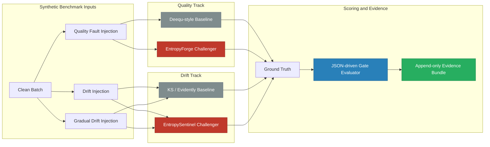
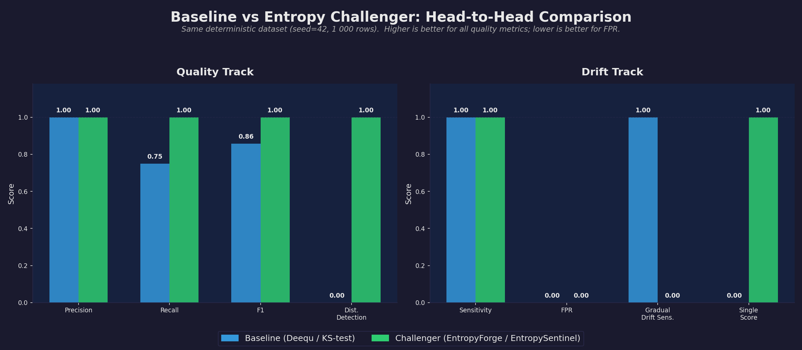
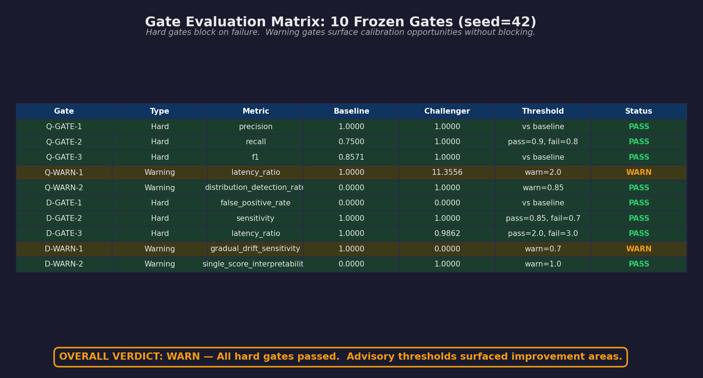
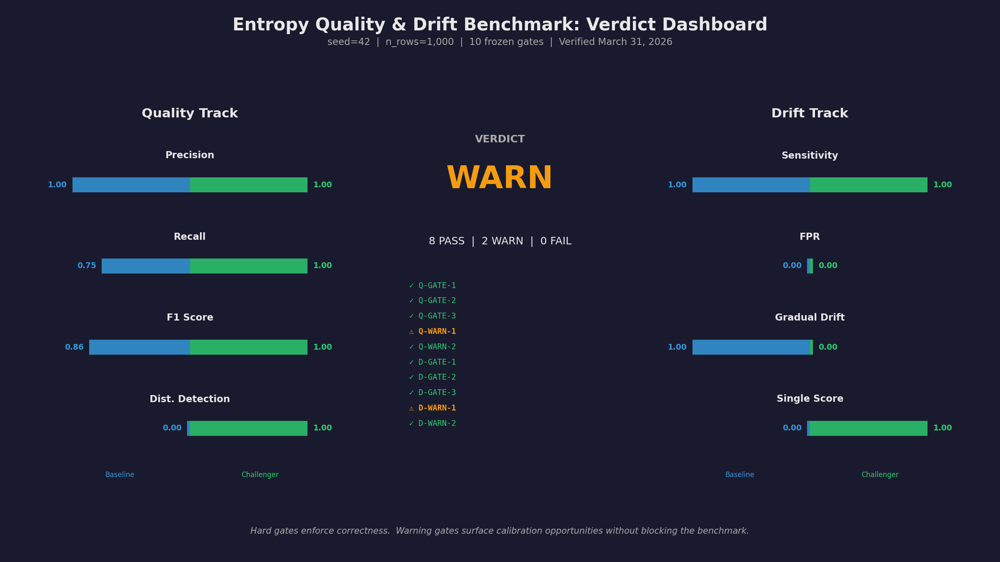

# Entropy Quality & Drift Benchmark

<p align="center">
  <a href="https://github.com/Org-EthereaLogic/entropy_quality_drift_benchmark/actions/workflows/ci.yml"></a>
  <a href="https://codecov.io/gh/Org-EthereaLogic/entropy_quality_drift_benchmark"></a>
  <a href="https://app.codacy.com/gh/Org-EthereaLogic/entropy_quality_drift_benchmark/dashboard"></a>
  <a href="https://snyk.io/"></a>
  <a href="https://www.python.org/"></a>
  <a href="https://opensource.org/licenses/MIT"></a>
</p>

**Built by [Anthony Johnson](https://www.linkedin.com/in/anthonyjohnsonii/) | EthereaLogic LLC**

---

## The Problem

Traditional data-quality checks — null counts, type assertions, range rules —
catch structural defects but miss **silent distribution degradation**. A column
can stay within range while its variance collapses to a single value. A
categorical feature can gain new categories that never appear in the training
set. A numeric distribution can drift gradually enough that a KS-test stays
below threshold until the damage reaches downstream reporting or AI workflows.

These are the failures that rule-based checks and single-test statistics leave
on the table.

**This benchmark demonstrates a governed, replayable way to compare traditional
baseline methods against Shannon Entropy-based challengers — and to prove,
with explainable gate verdicts and append-only evidence, exactly where
entropy-based evaluation outperforms structural rules and where it still needs
calibration.**

---

<details>
<summary><strong>Table of Contents</strong></summary>

- [The Problem](#the-problem)
- [How It Works](#how-it-works)
- [Benchmark Architecture](#benchmark-architecture)
- [See It in Action](#see-it-in-action)
- [Current Benchmark Verdict](#current-benchmark-verdict)
- [Understanding the WARN Verdict](#understanding-the-warn-verdict)
- [Dual-Track Evaluation](#dual-track-evaluation)
- [Gate Evaluation Matrix](#gate-evaluation-matrix)
- [Sample Evidence Output](#sample-evidence-output)
- [How This Maps to Databricks](#how-this-maps-to-databricks)
- [Technology Stack](#technology-stack)
- [Automation](#automation)
- [Quick Start](#quick-start)
- [Project Structure](#project-structure)
- [Agent and Claude Commands](#agent-and-claude-commands)
- [Contributing and Security](#contributing-and-security)

</details>

---

## How It Works

The benchmark runs two parallel evaluation tracks on identical deterministic
datasets:

- **Quality track**: `EntropyForge` (Shannon Entropy challenger) vs. Deequ-style
  rules (baseline) for data-quality validation
- **Drift track**: `EntropySentinel` (entropy + KL divergence challenger) vs.
  KS-test / Evidently-style checks (baseline) for drift detection

Every run evaluates **10 frozen gates** defined in
[`configs/kpi_thresholds.json`](configs/kpi_thresholds.json), writes the full
result to an append-only JSON evidence bundle in `runs/`, and produces a single
per-run verdict: `PASS`, `WARN`, `FAIL`, or `INCOMPLETE` when required metrics
are unavailable.

The goal is not to claim universal superiority. The goal is to show, with
replayable evidence, where entropy-based methods outperform structural rules
and where they currently remain warning-band only.

---

## Benchmark Architecture



The runner generates deterministic taxi-like datasets, injects known faults and
drift patterns, executes baseline and challenger adapters on identical inputs,
then evaluates the result against the frozen gate contract.

---

## See It in Action

The following visualizations are generated from a deterministic benchmark run
(`seed=42`, `n_rows=1000`).  Regenerate them with `python docs/generate_visuals.py`
after installing the `[docs]` extra (`pip install -e ".[docs]"`).

### Head-to-Head Track Comparison

Baseline adapters (Deequ-style rules, KS-test) vs. entropy challengers (EntropyForge, EntropySentinel) across all scored metrics. The recall gap in the quality track is where entropy catches the distribution collapse that rules miss.

<p align="center">
  
</p>

### Gate Evaluation Matrix

All 10 frozen gates evaluated against the benchmark output. Hard gates enforce correctness. Warning gates surface calibration opportunities. The overall WARN verdict reflects two advisory thresholds breaching while all hard gates pass.

<p align="center">
  
</p>

### Verdict Dashboard

A single-screen summary of the benchmark: quality track metrics (left), overall verdict with gate-by-gate status (center), and drift track metrics (right).

<p align="center">
  
</p>

---

## Current Benchmark Verdict

Verified locally on **March 30, 2026**:

- `ruff check src tests docs`: PASS
- `pytest tests/ -v --tb=short`: PASS (`26 passed`)
- `python -m entropy_quality_drift.runners.benchmark --seed 42 --rows 1000`: **`WARN`**

Measured local seeded result for `seed=42`, `n_rows=1000`:

| Track | Baseline | Challenger | Outcome |
| --- | --- | --- | --- |
| Quality recall | `0.75` | `1.00` | Entropy catches the distribution collapse the rules baseline misses |
| Quality F1 | `0.8571` | `1.00` | Challenger outperforms baseline |
| Drift sensitivity | `1.00` | `1.00` | Parity on the default sudden-drift scenario |
| Drift false positive rate | `0.00` | `0.00` | Parity on clean-vs-clean benchmark scoring |
| Overall verdict | n/a | **`WARN`** | All hard gates passed; advisory thresholds surfaced improvement areas |

---

## Understanding the WARN Verdict

An external reader may see `WARN` and assume the project failed. That is not
what happened.

The benchmark defines four verdict levels:

| Verdict | Meaning |
| --- | --- |
| **PASS** | All hard gates and all advisory (warning) gates cleared. |
| **WARN** | All hard gates passed. One or more advisory thresholds breached. |
| **FAIL** | At least one hard gate breached. The challenger has a critical deficiency. |
| **INCOMPLETE** | One or more required metrics were unavailable, so the benchmark could not assign a complete verdict. |

Normal completed benchmark runs produce `PASS`, `WARN`, or `FAIL`. `INCOMPLETE`
is reserved for partial execution or missing adapter output.

**The current `WARN` means the entropy challengers passed every hard gate** —
precision, recall, F1, false-positive rate, sensitivity, and latency all met
their required thresholds. The overall verdict is `WARN` because two advisory
gates still surface improvement opportunities:

- **`Q-WARN-1`** (quality latency ratio): `EntropyForge` currently runs ~12x
  slower than the rules baseline. The advisory target is 2x. This is expected
  for an entropy-based approach that computes per-column distribution statistics,
  and it does not affect correctness.
- **`D-WARN-1`** (gradual drift sensitivity): `EntropySentinel` does not yet
  detect gradual drift at the 0.7 sensitivity target under the current
  calibration. The KS-test baseline handles this case. This is the primary
  calibration opportunity for the entropy challenger.

In short: **the benchmark passed its hard requirements and the `WARN` verdict
is the honest, governed way to surface where entropy-based methods still need
improvement** rather than hiding those gaps behind a blanket `PASS`.

---

## Dual-Track Evaluation

### Quality Track

| Capability | Deequ-style Baseline | EntropyForge |
| --- | --- | --- |
| Schema checks | Yes | Yes |
| Null-rate checks | Yes | Yes |
| Range checks | Yes | Yes |
| Volume checks | Yes | Yes |
| Constant-column collapse detection | No | **Yes** |
| Entropy collapse detection | No | **Yes** |
| Distribution anomaly coverage metric | No | **Yes** |

**Current evidence:** the challenger improves recall from `0.75` to `1.00`
on the default seeded profile while holding precision at `1.00`.

### Drift Track

| Capability | KS / Evidently Baseline | EntropySentinel |
| --- | --- | --- |
| Sudden numeric shift detection | Yes | Yes |
| Sudden categorical shift detection | Yes | Yes |
| Clean-vs-clean false-positive control | Yes | Yes |
| Single interpretable batch score | No (primary surface) | **Yes** (primary surface) |
| Gradual drift sensitivity | Yes on current profile | WARN-band on current profile |

**Current evidence:** the challenger matches baseline sensitivity on the
default drift profile and passes the same-distribution false-positive test,
but it still misses the `D-WARN-1` gradual-drift target under the current
calibration.

---

## Gate Evaluation Matrix

The benchmark produces ten gates from the frozen configuration in
`configs/kpi_thresholds.json`.

| Gate | Type | Current Status (`seed=42`) | Meaning |
| --- | --- | --- | --- |
| `Q-GATE-1` | Hard | PASS | Challenger precision must not underperform baseline |
| `Q-GATE-2` | Hard | PASS | Challenger recall must clear the hard threshold |
| `Q-GATE-3` | Hard | PASS | Challenger F1 must not underperform baseline |
| `Q-WARN-1` | Warning | WARN | Quality latency ratio is currently above target |
| `Q-WARN-2` | Warning | PASS | Distribution anomaly detection rate clears target |
| `D-GATE-1` | Hard | PASS | Challenger false positive rate stays within allowed band |
| `D-GATE-2` | Hard | PASS | Challenger sensitivity clears the hard threshold |
| `D-GATE-3` | Hard | PASS | Drift latency ratio stays within the allowed band |
| `D-WARN-1` | Warning | WARN | Gradual drift sensitivity is still below target |
| `D-WARN-2` | Warning | PASS | Challenger exposes a single interpretable score |

The evaluator is configuration-driven: the code reads the JSON gate contract
and supports symbolic conditions (`>=baseline`), numeric thresholds, and
explicit `PASS` / `WARN` / `FAIL` / `INCOMPLETE` run verdicts.

---

## Sample Evidence Output

Every benchmark run writes a self-contained JSON evidence bundle. Below is an
abbreviated example from `seed=42, n_rows=1000`:

```json
{
  "run_id": "bench_42",
  "timestamp": "2026-03-31T01:44:05.061578+00:00",
  "seed": 42,
  "n_rows": 1000,
  "verdict": "WARN",
  "quality_track": {
    "baseline": { "adapter": "deequ_rules_baseline", "recall": 0.75, "f1": 0.8571, "..." : "..." },
    "challenger": { "adapter": "entropy_forge_challenger", "recall": 1.0, "f1": 1.0, "..." : "..." }
  },
  "drift_track": {
    "baseline": { "adapter": "evidently_ks_baseline", "sensitivity": 1.0, "..." : "..." },
    "challenger": { "adapter": "entropy_sentinel_challenger", "sensitivity": 1.0, "..." : "..." }
  },
  "gates": {
    "quality": [
      {
        "gate_id": "Q-GATE-2",
        "metric": "recall",
        "baseline": 0.75,
        "challenger": 1.0,
        "threshold": 0.9,
        "thresholds": { "pass_threshold": 0.9, "fail_threshold": 0.8 },
        "status": "PASS",
        "details": "PASS: challenger=1.000, baseline=0.750, threshold=0.9, fail=0.8"
      }
    ],
    "drift": [
      {
        "gate_id": "D-WARN-1",
        "metric": "gradual_drift_sensitivity",
        "baseline": 1.0,
        "challenger": 0.0,
        "threshold": 0.7,
        "thresholds": { "warn_threshold": 0.7 },
        "status": "WARN",
        "details": "WARN: challenger=0.000, baseline=1.000, threshold=0.7, fail=n/a"
      }
    ]
  }
}
```

Each gate result includes the full threshold context so the verdict is
explainable without cross-referencing the configuration file. Evidence bundles
are append-only — runs are never overwritten or deleted.

---

## How This Maps to Databricks

This benchmark is framework-agnostic Python, but its patterns map directly to
Databricks data-quality and drift-monitoring workflows. For a detailed
walkthrough, see **[docs/databricks_walkthrough.md](docs/databricks_walkthrough.md)**.

| Benchmark Concept | Databricks Equivalent |
| --- | --- |
| Synthetic clean/faulted batches | Delta table versions via Change Data Feed (CDF) |
| `DeequAdapter` baseline | Databricks Data Quality Expectations or `dbt-expectations` |
| `EntropyForge` challenger | Custom UDF or notebook computing per-column entropy |
| `EvidentlyAdapter` baseline | Lakehouse Monitoring statistical drift checks |
| `EntropySentinel` challenger | Custom drift monitor using entropy gradient + KL divergence |
| `configs/kpi_thresholds.json` | Unity Catalog tags or a governed `_quality_gates` Delta table |
| `runs/` evidence bundles | Append-only `_benchmark_evidence` Delta table |
| Gate evaluator | Databricks Workflow task with gate logic before promotion |

The repository includes abstract integration seams (`CDFReaderBase`,
`IngestionLoggerBase`) in
[`src/entropy_quality_drift/databricks_seams/`](src/entropy_quality_drift/databricks_seams/__init__.py)
that show where a production Databricks deployment would plug in without
changing the benchmark runner.

---

## Technology Stack

| Component | Technology |
| --- | --- |
| Runtime | Python |
| Data model | pandas + numpy |
| Statistical baseline | scipy KS / chi-squared |
| Quality baseline | Deequ-style rules |
| Challengers | Shannon Entropy + KL divergence |
| Validation | pytest + Ruff |
| Coverage | pytest-cov + Codecov + Codacy upload |
| Security scanning | Snyk code scan on main pushes |
| Automation | GitHub Actions |

## Automation

- **CI matrix:** Python `3.10`, `3.11`, and `3.12`
- **Lint gate:** `ruff check src tests docs`
- **Test gate:** `pytest tests/ -v --tb=short --cov=src --cov-report=xml:coverage.xml`
- **Coverage upload:** Codecov and Codacy uploads on pushes to `main`
- **Security scan:** Snyk code scanning on pushes to `main`; missing or invalid `SNYK_TOKEN` downgrades the scan to a workflow warning instead of a CI blocker

The current workflow uses:

- `CODACY_PROJECT_TOKEN`
- `CODECOV_TOKEN`
- `SNYK_TOKEN` for Snyk code scanning; when absent or invalid, CI emits a warning and skips the scan without failing the workflow

---

## Quick Start

### 1. Clone and Install

```bash
git clone https://github.com/Org-EthereaLogic/entropy_quality_drift_benchmark.git
cd entropy_quality_drift_benchmark
python3.12 -m venv .venv
. .venv/bin/activate
python -m pip install --upgrade pip
python -m pip install -e ".[dev]"
```

### 2. Run Lint and Tests

```bash
ruff check src tests docs
pytest tests/ -v --tb=short
```

### 3. Run the Full Benchmark

```bash
python -m entropy_quality_drift.runners.benchmark --seed 42 --rows 1000
```

### 4. Run the Key Proof Test

```bash
pytest tests/test_quality_track.py::TestEntropyAdvantage::test_constant_collapse_deequ_misses_forge_catches -v
```

### 5. Inspect Generated Evidence

Each run writes a unique JSON artifact to `runs/` or the `--evidence-dir` you
provide:

```bash
python -m entropy_quality_drift.runners.benchmark --seed 42 --rows 1000 --evidence-dir /tmp/entropy_runs
ls /tmp/entropy_runs
```

---

## Project Structure

```text
entropy_quality_drift_benchmark/
├── AGENTS.md
├── CLAUDE.md
├── README.md
├── pyproject.toml
├── configs/
│   └── kpi_thresholds.json
├── docs/
│   ├── databricks_walkthrough.md
│   ├── generate_visuals.py
│   └── images/
│       ├── track_comparison.png
│       ├── gate_evaluation.png
│       └── benchmark_verdict.png
├── .claude/
│   ├── agents/
│   │   ├── cleanup_workspace.md
│   │   ├── examine.md
│   │   ├── lead-experiment-engineer.md
│   │   ├── sdlc-technical-writer.md
│   │   └── test-automator.md
│   └── commands/
│       ├── benchmark.md
│       ├── cleanup_workspace.md
│       ├── commit.md
│       ├── doc-maintain.md
│       ├── examine.md
│       ├── review.md
│       ├── sync.md
│       └── verify.md
├── src/entropy_quality_drift/
│   ├── baselines/
│   ├── challengers/
│   ├── contracts/
│   ├── datasets/
│   ├── databricks_seams/
│   ├── evidence/
│   ├── metrics/
│   └── runners/
├── tests/
└── runs/
```

---

## Agent and Claude Commands

This repository includes the reusable command surface carried forward from
the prior experiment line, adapted for the public entropy benchmark:

- `/benchmark` — run the benchmark harness and summarize gate output
- `/cleanup_workspace` — preview or perform safe local cleanup
- `/commit` — generate a scoped Conventional Commit
- `/doc-maintain` — audit and update living documentation
- `/examine` — independently examine a target from primary sources
- `/review` — review a change against benchmark semantics
- `/sync` — sync docs, commands, and workflow-facing artifacts
- `/verify` — perform a non-destructive evidence-based verification pass

Reusable agent briefs live in `.claude/agents/` for implementation, technical
writing, deterministic test work, independent examination, and safe workspace
cleanup.

---

## Contributing and Security

- Contribution process: see [CONTRIBUTING.md](CONTRIBUTING.md)
- Security reporting: see [SECURITY.md](SECURITY.md)
- License: [MIT](LICENSE)

## What This Repository Does Not Include

- Proprietary UMIF-era primitives or formulas
- Client data or client identifiers
- Production credentials
- Claims beyond the measured benchmark evidence
