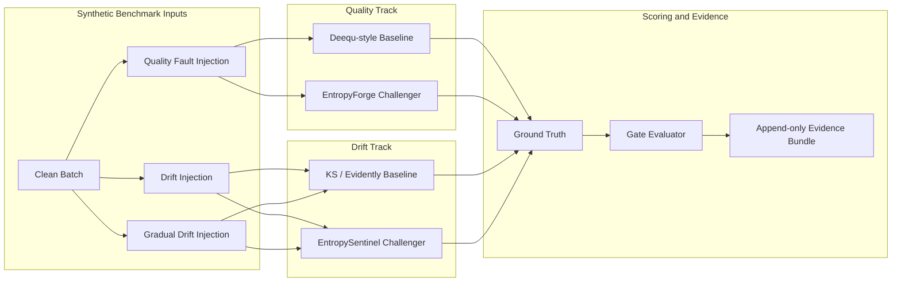

# Technical Approach

This page captures the technical detail behind the executive-facing README. It documents what the benchmark actually implements, what the current seeded run proves, and how to reproduce the evidence without turning the public README into an operator handbook.

## What Is Implemented Here

| Surface | Included in this repository |
| ------- | --------------------------- |
| Benchmark harness | Deterministic clean, faulted, and drifted dataset generation with dual-track scoring and a governed per-run verdict |
| Baselines | Deequ-style quality rules and KS/Evidently-style drift checks |
| Challengers | `EntropyForge` for quality degradation and `EntropySentinel` for drift |
| Evidence path | Append-only JSON evidence bundles, committed docs fixture, reproducible visuals, and a seeded benchmark CLI |
| Platform mapping | A separate Databricks walkthrough that translates the benchmark pattern into lakehouse operations |

The benchmark is pure Python. It does not provision Databricks infrastructure, Unity Catalog, or workflow assets.

## Benchmark Architecture



## Competing Methods

| Track | Baseline | Challenger | What the challenger adds |
| ----- | -------- | ---------- | ------------------------ |
| Quality | Deequ-style rules for schema, nulls, ranges, volume, and duplicate-key faults | `EntropyForge` | Detects entropy collapse, constant-column failure, and distribution anomalies that rule checks can miss |
| Drift | KS/Evidently-style statistical drift checks | `EntropySentinel` | Produces a single interpretable score and combines entropy and KL-divergence signals |

## Measurement Notes

The quality challenger uses Shannon entropy to quantify how much diversity remains in a column:

```text
H(X) = −Σ p(xᵢ) × log₂(p(xᵢ))
```

Interpretation:

- `0` means the column has collapsed to a constant.
- Higher values mean the distribution remains diverse.
- Changes in entropy between trusted and current batches expose silent degradation that rule checks may not surface.

The drift challenger combines entropy changes with KL divergence so it can compare both sudden and gradual distribution shifts.

## Current Verified Seeded Result

Verified locally on **March 31, 2026** with `seed=42` and `n_rows=1000`:

| Area | Baseline | Challenger | Result |
| ---- | -------- | ---------- | ------ |
| Quality recall | `0.80` | `1.00` | Challenger advantage |
| Quality F1 | `0.8889` | `1.00` | Challenger advantage |
| Drift sensitivity | `1.00` | `1.00` | Parity on default sudden-drift profile |
| Drift false positive rate | `0.00` | `0.00` | Parity on clean-vs-clean scoring |
| Overall verdict | n/a | `WARN` | All hard gates pass; two advisory thresholds remain open |

Open advisory gaps in the same run:

- `Q-WARN-1`: quality latency ratio `11.49x` against a `2.0x` warning target
- `D-WARN-1`: gradual-drift sensitivity `0.00` against a `0.70` warning target

## Gate Contract

The seeded run evaluates ten frozen gates from `configs/kpi_thresholds.json`.

| Gate | Type | Current status | Meaning |
| ---- | ---- | -------------- | ------- |
| `Q-GATE-1` | Hard | PASS | Challenger precision must not underperform baseline |
| `Q-GATE-2` | Hard | PASS | Challenger recall must clear the hard threshold |
| `Q-GATE-3` | Hard | PASS | Challenger F1 must not underperform baseline |
| `Q-WARN-1` | Warning | WARN | Quality latency ratio is above target |
| `Q-WARN-2` | Warning | PASS | Distribution anomaly detection rate clears target |
| `D-GATE-1` | Hard | PASS | Challenger false positive rate stays within allowed band |
| `D-GATE-2` | Hard | PASS | Challenger sensitivity clears the hard threshold |
| `D-GATE-3` | Hard | PASS | Drift latency ratio stays within allowed band |
| `D-WARN-1` | Warning | WARN | Gradual drift sensitivity is below target |
| `D-WARN-2` | Warning | PASS | Challenger exposes a single interpretable score |

## Evidence Model

Every successful benchmark run writes a self-contained JSON evidence bundle. The current schema includes:

- `evidence_schema_version`
- run metadata such as `run_id`, `seed`, `n_rows`, and `timestamp`
- baseline and challenger scores for both tracks
- gate results with threshold context
- the overall verdict

Use `docs/fixtures/sample_evidence_seed42.json` or a run with `"evidence_schema_version": 2` when you want the current self-contained gate format. The `runs/` archive is append-only and intentionally retains older schema revisions.

## Reproducible Evidence Path

Run these commands from the repository root:

```bash
python3.12 -m venv .venv
. .venv/bin/activate
python -m pip install --upgrade pip
python -m pip install -e ".[dev]"
ruff check src tests docs
pytest tests/ -v --tb=short
python -m entropy_quality_drift.runners.benchmark --seed 42 --rows 1000
```

Optional exhibit regeneration:

```bash
python -m pip install -e ".[docs]"
python docs/generate_visuals.py
```

The current verified benchmark should produce:

- `29` passing tests
- overall verdict `WARN`
- quality recall `0.80` baseline vs `1.00` challenger
- quality F1 `0.8889` baseline vs `1.00` challenger
- drift sensitivity parity at `1.00`

## Repo Map

| Path | Role |
| ---- | ---- |
| `src/entropy_quality_drift/runners/benchmark.py` | Public benchmark CLI and orchestration |
| `src/entropy_quality_drift/baselines/` | Quality and drift baseline adapters |
| `src/entropy_quality_drift/challengers/` | Entropy-based challengers |
| `src/entropy_quality_drift/metrics/gate_evaluator.py` | 10-gate verdict logic |
| `configs/kpi_thresholds.json` | Frozen gate semantics |
| `docs/fixtures/sample_evidence_seed42.json` | Stable fixture for docs replay |
| `docs/generate_visuals.py` | Deterministic exhibit generation |
| `docs/databricks_walkthrough.md` | Databricks mapping for the benchmark pattern |

## Related Public Docs

- Executive overview: [README.md](../README.md)
- Databricks mapping: [docs/databricks_walkthrough.md](databricks_walkthrough.md)
- Contribution workflow: [CONTRIBUTING.md](../CONTRIBUTING.md)
- Security reporting: [SECURITY.md](../SECURITY.md)
